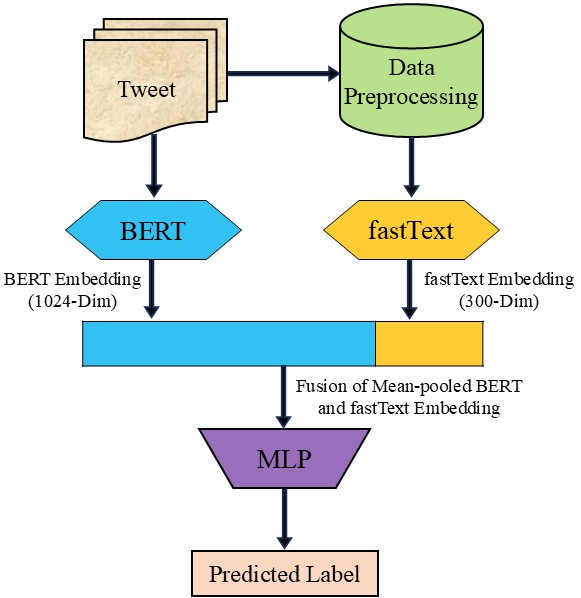

# Enhanced Hate Speech Detection through Mean-Pooling in Embedding Fusion

This repository contains the code and resources for the research project titled **"Enhanced Hate Speech Detection through Mean-Pooling in Embedding Fusion"**. The thesis focuses on developing an improved method for detecting hate speech and classifying aggressive behavior along with target identification using deep learning models.

This work was presented at the **27th International Conference on Computer and Information Technology (ICCIT 2024)** and was co-authored with **Md. Nesarul Hoque**, **Dr. Abu Nowshed Chy**, and **Dr. Md. Hanif Seddiqui**.

## Research Overview

### Problem Statement
The increasing prevalence of hate speech online is a major concern. Our research focuses on two key subtasks:
1. **Hate Speech Detection (Subtask A)**: Detecting hateful content in social media posts.
2. **Aggressive Behavior and Target Classification (Subtask B)**: Classifying aggressive behavior and identifying the target of the aggression.

### Motivation
Hate speech on social media platforms poses significant challenges, contributing to social division and prejudice. While many studies have addressed hate speech detection, fewer have explored aggressive behavior and target classification. The performance of existing models has not been satisfactory in both subtasks, which motivated us to propose a advanced solution.

### Objectives
- Promote safer online communications.
- Help in mitigating harmful content.
- Develop a model that excels in both hate speech detection and aggressive behavior classification.

## Methodology

## Experiments and Results

Our experiments show the following results:
- **Subtask A (Hate Speech Detection)**: Achieved an F1-score of **65%**.
- **Subtask B (Aggressive Behavior and Target Classification)**: Achieved an F1-score of **67%**.

In comparative performance, our method outperforms other methods in Subtask B in terms of F1-score, demonstrating its robustness and effectiveness in handling aggressive behavior classification.

## Acknowledgments

- **SemEval 2019 Task 5 Dataset**: Special thanks to the creators and contributors of the SemEval 2019 Task 5 dataset for providing a valuable resource for hate speech detection research..
- **Collaborators**: Md. Nesarul Hoque, Dr. Abu Nowshed Chy, and Dr. Md. Hanif Seddiqui for their continuous guidance and contributions to the research.
- **ICCIT**: For providing an excellent platform to present and share this research with the community.
